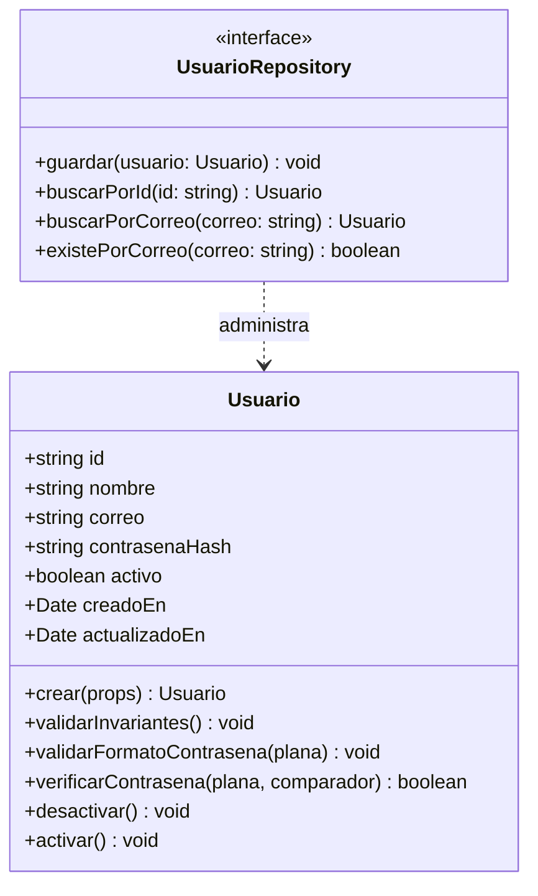

# Modelo de Dominio y Datos: Autenticación de Usuarios (001-user-auth)

## Entidades y Agregados (Capa Model / Dominio)

Siguiendo el **Principio II de la Constitución (Rich Domain Model)**, las entidades de dominio encapsulan tanto sus datos como su lógica y reglas de negocio. Está estrictamente prohibido el uso de modelos anémicos.



### 1. Entidad: `Usuario` (Aggregate Root)

Representa a una persona registrada en la plataforma de tokens de fútbol.

#### Atributos
| Atributo | Tipo | Descripción | Regla / Restricción |
|----------|------|-------------|---------------------|
| `id` | `string` (UUID v4) | Identificador único del usuario | Generado al crear la entidad; inmutable |
| `nombre` | `string` | Nombre o apodo del usuario | Requerido, no vacío, longitud entre 2 y 100 caracteres |
| `correo` | `string` | Correo electrónico de acceso | Requerido, normalizado (minúsculas y trim), formato válido, único en el sistema |
| `contrasenaHash` | `string` | Hash seguro de la contraseña | Requerido, generado mediante algoritmo de hashing criptográfico unidireccional |
| `activo` | `boolean` | Estado de la cuenta | Por defecto `true` |
| `creadoEn` | `Date` | Fecha de creación del registro | Inmutable |
| `actualizadoEn` | `Date` | Fecha de última modificación | Actualizado ante cambios |

#### Métodos de Negocio e Invariantes
- **`crear(props)` (Factory)**: Instancia un nuevo `Usuario` validando previamente todas las invariantes de negocio y aplicando normalización de correo.
- **`validarInvariantes()`**:
  - `correo`: no vacío, expresión regular estándar RFC 5322.
  - `nombre`: entre 2 y 100 caracteres, sin espacios residuales al inicio/fin.
  - `contrasenaHash`: no vacía.
- **`validarFormatoContrasena(contrasenaPlana)` (Domain Rule)**:
  - Longitud mínima: 8 caracteres.
  - Debe contener al menos una letra mayúscula, una letra minúscula y un número.
  - En caso de incumplimiento, lanza una excepción de dominio (`ReglaDeNegocioException` o `ErrorDeValidacionDeDominio`).
- **`verificarContrasena(contrasenaPlana, comparador)`**:
  - Comprueba si la contraseña ingresada coincide con el `contrasenaHash` almacenado, utilizando una función comparadora segura (ej. bcrypt).
  - Lanza error si la cuenta no se encuentra activa.
- **`desactivar()`**: Cambia el estado `activo = false` y actualiza `actualizadoEn`.
- **`activar()`**: Cambia el estado `activo = true` y actualiza `actualizadoEn`.

---

## Puerto de Persistencia: `UsuarioRepository` (Capa Model)

Interfaz definida en el dominio para ser implementada en la capa de Data Access:

```typescript
export interface UsuarioRepository {
  guardar(usuario: Usuario): Promise<void>;
  buscarPorId(id: string): Promise<Usuario | null>;
  buscarPorCorreo(correo: string): Promise<Usuario | null>;
  existePorCorreo(correo: string): Promise<boolean>;
}
```

---

## Modelo de Persistencia: `UsuarioOrmEntity` (Capa Data Access)

Mapeo específico a la base de datos relacional PostgreSQL (tabla `usuarios`).

### Esquema de Tabla: `usuarios`

| Columna | Tipo SQL | Modificadores | Descripción |
|---------|----------|---------------|-------------|
| `id` | `UUID` | `PRIMARY KEY` | Identificador único |
| `nombre` | `VARCHAR(100)` | `NOT NULL` | Nombre del usuario |
| `correo` | `VARCHAR(255)` | `NOT NULL UNIQUE` | Correo electrónico único indexado |
| `contrasena_hash` | `VARCHAR(255)` | `NOT NULL` | Hash de la contraseña |
| `activo` | `BOOLEAN` | `NOT NULL DEFAULT TRUE` | Estado activo/inactivo |
| `creado_en` | `TIMESTAMPTZ` | `NOT NULL DEFAULT CURRENT_TIMESTAMP` | Timestamp de creación |
| `actualizado_en` | `TIMESTAMPTZ` | `NOT NULL DEFAULT CURRENT_TIMESTAMP` | Timestamp de modificación |

### Mapeo Bidireccional (Mapper)
- `UsuarioMapper.toDomain(ormEntity: UsuarioOrmEntity): Usuario`: Reconstruye la entidad de dominio completa respetando su encapsulamiento.
- `UsuarioMapper.toOrm(domainEntity: Usuario): UsuarioOrmEntity`: Transfiere los atributos de dominio hacia la entidad de persistencia.

---

## Objetos de Transferencia y Contratos de Sesión (Capa Service / Controller)

### DTOs de Entrada
- `RegistroUsuarioDto`: `{ nombre: string, correo: string, contrasena: string }`
- `LoginUsuarioDto`: `{ correo: string, contrasena: string }`

### DTOs de Salida
- `RespuestaAutenticacionDto`: `{ tokenDeAcceso: string, tipo: 'Bearer', usuario: { id: string, nombre: string, correo: string } }`
- `PerfilUsuarioDto`: `{ id: string, nombre: string, correo: string, activo: boolean, creadoEn: string }`
