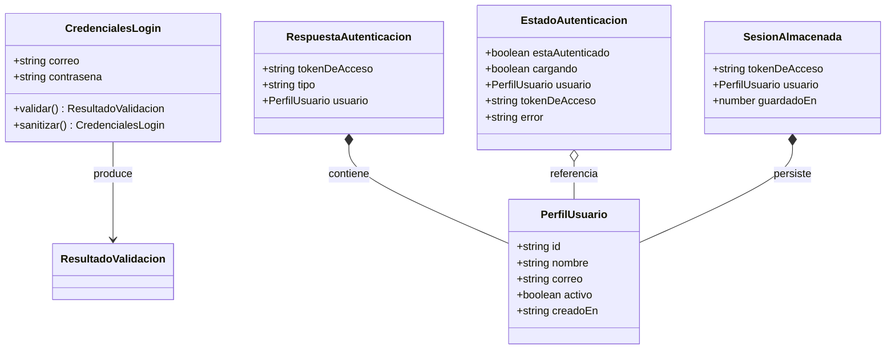
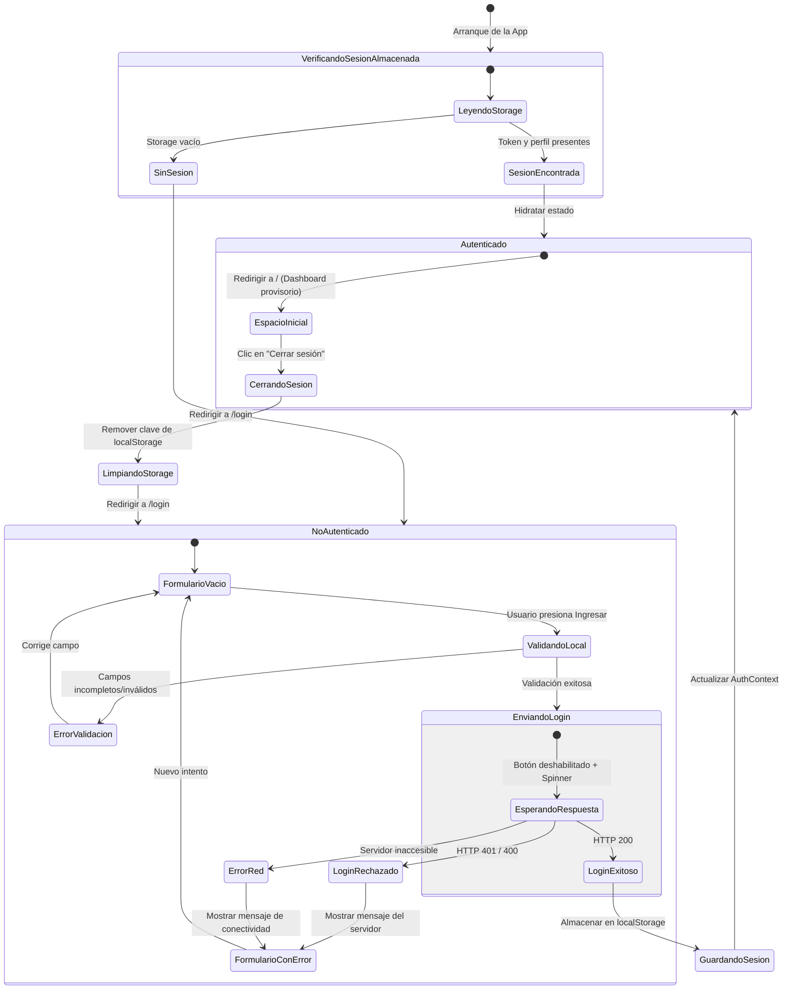

# Modelo de Datos y Estados: Frontend Login & Sesión (002-frontend-login)

## 1. Entidades y Modelos del Cliente (TypeScript)

El frontend modela de forma estricta los datos de autenticación, validación y sesión en el navegador, manteniendo congruencia con los contratos del backend y las directrices de la Constitución (Principio V: nombres de dominio en español sin acentos ni ñ).



---

### 1.1 `CredencialesLogin`

Representa los datos suministrados por el usuario en el formulario de inicio de sesión.

| Campo | Tipo | Requerido | Regla / Restricción de Validación en Cliente |
| :--- | :--- | :---: | :--- |
| `correo` | `string` | Sí | No vacío. Formato válido de email (regex: `^[^\s@]+@[^\s@]+\.[^\s@]+$`). Se aplica `trim()` y minúsculas al enviar. |
| `contrasena` | `string` | Sí | No vacía. Mínimo 1 carácter (la verificación de complejidad completa reside en el backend/dominio). |

**Reglas de Validación (`ResultadoValidacion`)**:
- Si `correo` está vacío: `"El correo electrónico es obligatorio."`
- Si `correo` no tiene formato válido: `"El formato del correo electrónico es inválido."`
- Si `contrasena` está vacía: `"La contraseña es obligatoria."`

---

### 1.2 `PerfilUsuario`

Información del inversor/usuario desplegada en la interfaz tras la autenticación.

| Campo | Tipo | Descripción |
| :--- | :--- | :--- |
| `id` | `string` (UUID v4) | Identificador único del usuario devuelto por el backend. |
| `nombre` | `string` | Nombre para mostrar en el saludo y perfil de la aplicación. |
| `correo` | `string` | Dirección de correo asociada a la cuenta. |
| `activo` | `boolean` | Indica si la cuenta se encuentra habilitada para operar. |
| `creadoEn` | `string` (ISO 8601) | Fecha de registro del usuario en la plataforma. |

---

### 1.3 `RespuestaAutenticacion`

Payload recibido desde el endpoint `POST /api/auth/login` con código HTTP 200.

| Campo | Tipo | Descripción |
| :--- | :--- | :--- |
| `tokenDeAcceso` | `string` | JWT firmado por el backend con claims `sub` y `email`. |
| `tipo` | `string` | Tipo de esquema de autorización (valor esperado: `'Bearer'`). |
| `usuario` | `PerfilUsuario` | Datos básicos del usuario autenticado. |

---

### 1.4 `EstadoAutenticacion` (AuthContext State)

Estado reactivo global gestionado por `AuthProvider`.

| Atributo | Tipo | Valor Inicial | Descripción |
| :--- | :--- | :---: | :--- |
| `estaAutenticado` | `boolean` | `false` | Indica si existe un usuario con sesión activa y token válido. |
| `cargando` | `boolean` | `true` | `true` durante la hidratación inicial desde almacenamiento o petición de login; `false` cuando finaliza. |
| `usuario` | `PerfilUsuario \| null` | `null` | Perfil del usuario autenticado actual. |
| `tokenDeAcceso` | `string \| null` | `null` | JWT para firmar llamadas autenticadas a la API. |
| `error` | `string \| null` | `null` | Mensaje de error amigable actual en español. |

---

### 1.5 `SesionAlmacenada` (Persistencia Local)

Estructura persistida en `localStorage` bajo la clave `football_marketplace_session`.

```typescript
export interface SesionAlmacenada {
  tokenDeAcceso: string;
  usuario: PerfilUsuario;
  guardadoEn: number; // timestamp en milisegundos
}
```

---

## 2. Máquina de Estados del Flujo de Autenticación


