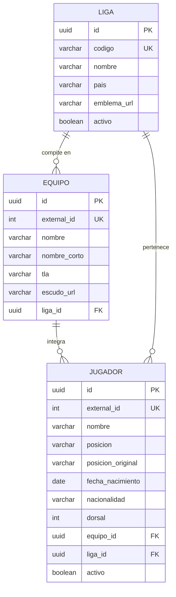

# Data Model: Catálogo y Filtros de Jugadores de las 5 Grandes Ligas

**Feature Branch**: `003-player-catalog`  
**Date**: 2026-09-21  

---

## 1. Entidades del Dominio (Rich Domain Entities)

Siguiendo el **Principio II (Rich Domain Model y DDD)** de la Constitución, las entidades contienen sus propias invariantes, reglas de validación y comportamiento de negocio. No existen objetos anémicos.

### 1.1. Entidad `Liga`

Representa una de las 5 grandes competiciones del fútbol europeo.

- **Campos**:
  - `id`: `string` (UUID v4) — Identificador único del sistema.
  - `codigo`: `string` — Código canónico de la competición (`PL`, `PD`, `SA`, `BL1`, `FL1`).
  - `nombre`: `string` — Nombre oficial (ej. "Premier League", "La Liga", "Serie A", "Bundesliga", "Ligue 1").
  - `pais`: `string` — País de la competición (ej. "Inglaterra", "España", "Italia", "Alemania", "Francia").
  - `emblemaUrl`: `string | null` — URL del logotipo oficial.
  - `activo`: `boolean` — Estado de disponibilidad en la plataforma.
  - `creadoEn`: `Date`
  - `actualizadoEn`: `Date`

- **Invariantes y Reglas de Negocio**:
  - El código debe pertenecer estrictamente al conjunto admitido (`PL`, `PD`, `SA`, `BL1`, `FL1`).
  - El nombre es obligatorio y debe tener entre 3 y 100 caracteres.
  - El país es obligatorio.

---

### 1.2. Entidad `Equipo`

Representa a un club de fútbol que compite en una de las 5 grandes ligas.

- **Campos**:
  - `id`: `string` (UUID v4) — Identificador único interno.
  - `externalId`: `number` — Identificador en la API de football-data.org (para sincronización idempotente).
  - `nombre`: `string` — Nombre completo oficial del club (ej. "Arsenal FC", "Real Madrid CF").
  - `nombreCorto`: `string` — Nombre abreviado comercial (ej. "Arsenal", "Real Madrid").
  - `tla`: `string` — Sigla de 3 letras (ej. "ARS", "RMA").
  - `escudoUrl`: `string | null` — URL del escudo del club.
  - `ligaId`: `string` — Identificador interno de la liga a la que pertenece.
  - `creadoEn`: `Date`
  - `actualizadoEn`: `Date`

- **Invariantes y Reglas de Negocio**:
  - El nombre del club es obligatorio (mínimo 2 caracteres).
  - `externalId` debe ser un entero positivo.
  - `ligaId` es obligatorio; un club no puede existir sin su liga asociada.
  - Método de dominio `perteneceALiga(ligaId: string): boolean`.

---

### 1.3. Entidad `Jugador` (Agregado Principal)

Representa a un futbolista profesional que forma parte del plantel de un equipo en las 5 grandes ligas.

- **Campos**:
  - `id`: `string` (UUID v4) — Identificador único del activo en el sistema.
  - `externalId`: `number` — Identificador del futbolista en football-data.org.
  - `nombre`: `string` — Nombre completo del futbolista (ej. "Bukayo Saka", "Luka Modrić").
  - `posicion`: `PosicionJugador` — Posición táctica normalizada: `'Portero' | 'Defensa' | 'Mediocampista' | 'Delantero' | 'No Clasificado'`.
  - `posicionOriginal`: `string` — Posición descriptiva tal como proviene de la fuente externa (ej. "Right Winger", "Goalkeeper").
  - `fechaNacimiento`: `string | null` — Fecha de nacimiento en formato ISO (`YYYY-MM-DD`).
  - `nacionalidad`: `string` — País o nacionalidad del futbolista.
  - `dorsal`: `number | null` — Número de camiseta.
  - `equipoId`: `string` — Identificador del equipo al que pertenece.
  - `ligaId`: `string` — Identificador de la liga a la que pertenece.
  - `activo`: `boolean` — Si se encuentra disponible en el catálogo activo.
  - `creadoEn`: `Date`
  - `actualizadoEn`: `Date`

- **Invariantes y Reglas de Negocio**:
  - El nombre es obligatorio y debe tener entre 2 y 150 caracteres.
  - `externalId` debe ser un número entero positivo único.
  - `equipoId` y `ligaId` son obligatorios.
  - **Mapeo y Normalización de Posición**:
    - "Goalkeeper" / "Arquero" → `Portero`
    - "Defence" / "Defender" / "Centre-Back" / "Left-Back" / "Right-Back" → `Defensa`
    - "Midfield" / "Midfielder" / "Defensive Midfield" / "Attacking Midfield" / "Central Midfield" → `Mediocampista`
    - "Offence" / "Forward" / "Winger" / "Centre-Forward" / "Striker" → `Delantero`
    - Otros / desconocido → `No Clasificado`
  - Método de dominio `actualizarEquipo(nuevoEquipoId: string, nuevaLigaId: string)`.
  - Método de dominio `coincideConFiltros(criterio: CriterioFiltroJugador): boolean`.

---

### 1.4. Value Object: `CriterioFiltroJugador`

Encapsula los parámetros de filtrado y búsqueda del catálogo, asegurando la consistencia entre los mismos.

- **Atributos**:
  - `ligaCodigo`: `string | null`
  - `equipoId`: `string | null`
  - `posicion`: `PosicionJugador | null`
  - `busqueda`: `string | null`
  - `pagina`: `number` (default: 1, mínimo: 1)
  - `limite`: `number` (default: 20, máximo: 50)

- **Reglas de Negocio del Value Object**:
  - Normaliza la cadena de búsqueda eliminando espacios redundantes.
  - Si se define una liga y un equipo, valida que el equipo pertenezca a dicha liga (en caso contrario, anula o rechaza el filtro inconsistente).
  - Calcula el `offset` para la consulta SQL: `(pagina - 1) * limite`.

---

## 2. Esquema Físico de Base de Datos (PostgreSQL / TypeORM)

### 2.1. Tabla `ligas`
```sql
CREATE TABLE ligas (
  id UUID PRIMARY KEY DEFAULT gen_random_uuid(),
  codigo VARCHAR(10) UNIQUE NOT NULL,
  nombre VARCHAR(100) NOT NULL,
  pais VARCHAR(100) NOT NULL,
  emblema_url VARCHAR(500),
  activo BOOLEAN DEFAULT TRUE NOT NULL,
  creado_en TIMESTAMP WITH TIME ZONE DEFAULT NOW() NOT NULL,
  actualizado_en TIMESTAMP WITH TIME ZONE DEFAULT NOW() NOT NULL
);

CREATE INDEX idx_ligas_codigo ON ligas(codigo);
```

### 2.2. Tabla `equipos`
```sql
CREATE TABLE equipos (
  id UUID PRIMARY KEY DEFAULT gen_random_uuid(),
  external_id INTEGER UNIQUE NOT NULL,
  nombre VARCHAR(150) NOT NULL,
  nombre_corto VARCHAR(100),
  tla VARCHAR(10),
  escudo_url VARCHAR(500),
  liga_id UUID NOT NULL REFERENCES ligas(id) ON DELETE CASCADE,
  creado_en TIMESTAMP WITH TIME ZONE DEFAULT NOW() NOT NULL,
  actualizado_en TIMESTAMP WITH TIME ZONE DEFAULT NOW() NOT NULL
);

CREATE INDEX idx_equipos_liga_id ON equipos(liga_id);
CREATE INDEX idx_equipos_external_id ON equipos(external_id);
```

### 2.3. Tabla `jugadores`
```sql
CREATE TABLE jugadores (
  id UUID PRIMARY KEY DEFAULT gen_random_uuid(),
  external_id INTEGER UNIQUE NOT NULL,
  nombre VARCHAR(150) NOT NULL,
  posicion VARCHAR(50) NOT NULL,
  posicion_original VARCHAR(50),
  fecha_nacimiento DATE,
  nacionalidad VARCHAR(100),
  dorsal INTEGER,
  equipo_id UUID NOT NULL REFERENCES equipos(id) ON DELETE CASCADE,
  liga_id UUID NOT NULL REFERENCES ligas(id) ON DELETE CASCADE,
  activo BOOLEAN DEFAULT TRUE NOT NULL,
  creado_en TIMESTAMP WITH TIME ZONE DEFAULT NOW() NOT NULL,
  actualizado_en TIMESTAMP WITH TIME ZONE DEFAULT NOW() NOT NULL
);

CREATE INDEX idx_jugadores_liga_id ON jugadores(liga_id);
CREATE INDEX idx_jugadores_equipo_id ON jugadores(equipo_id);
CREATE INDEX idx_jugadores_posicion ON jugadores(posicion);
CREATE INDEX idx_jugadores_nombre_busqueda ON jugadores USING gin (to_tsvector('spanish', nombre));
CREATE INDEX idx_jugadores_external_id ON jugadores(external_id);
```

---

## 3. Relaciones y Ciclo de Vida de Sincronización



### Proceso de Sincronización Idempotente
1. Verificar si la tabla `jugadores` cuenta con al menos 1 registro (`count() > 0`).
2. Si está vacía (`count === 0`):
   - Invocar secuencialmente los 5 códigos de liga de football-data.org (`PL`, `PD`, `SA`, `BL1`, `FL1`).
   - Mapear e insertar/actualizar la `Liga`.
   - Por cada equipo del arreglo `teams`: mapear e insertar/actualizar `Equipo`.
   - Por cada jugador del arreglo `squad`: normalizar posición, mapear e insertar/actualizar `Jugador`.
3. Finalizada la sincronización inicial, todas las lecturas subsiguientes se ejecutan exclusivamente sobre PostgreSQL.

---

## 4. Contratos de Repositorio de Dominio (Interfaces)

Siguiendo el **Principio I** de la Constitución (Data Access Repository visible únicamente para la capa de dominio):

```typescript
export interface IJugadorRepository {
  guardar(jugador: Jugador): Promise<Jugador>;
  guardarMuchos(jugadores: Jugador[]): Promise<void>;
  buscarPorId(id: string): Promise<Jugador | null>;
  buscarPorExternalId(externalId: number): Promise<Jugador | null>;
  buscarConFiltros(criterio: CriterioFiltroJugador): Promise<{ items: Jugador[]; total: number }>;
  contarTotal(): Promise<number>;
}

export interface IEquipoRepository {
  guardar(equipo: Equipo): Promise<Equipo>;
  guardarMuchos(equipos: Equipo[]): Promise<void>;
  buscarPorId(id: string): Promise<Equipo | null>;
  buscarPorExternalId(externalId: number): Promise<Equipo | null>;
  listarTodos(): Promise<Equipo[]>;
  listarPorLiga(ligaId: string): Promise<Equipo[]>;
}

export interface ILigaRepository {
  guardar(liga: Liga): Promise<Liga>;
  guardarMuchos(ligas: Liga[]): Promise<void>;
  buscarPorId(id: string): Promise<Liga | null>;
  buscarPorCodigo(codigo: string): Promise<Liga | null>;
  listarTodas(): Promise<Liga[]>;
}
```
