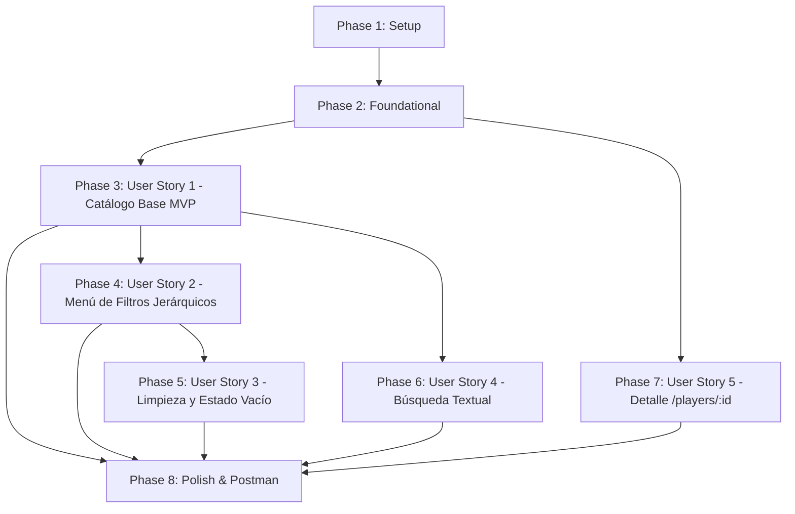

# Tasks: Catálogo y Filtros de Jugadores de las 5 Grandes Ligas

**Feature Branch**: `003-player-catalog` | **Date**: 2026-09-21 | **Spec**: [specs/003-player-catalog/spec.md](file:///home/nikkoros/dev/dapps2026GrupoQ/specs/003-player-catalog/spec.md) | **Plan**: [specs/003-player-catalog/plan.md](file:///home/nikkoros/dev/dapps2026GrupoQ/specs/003-player-catalog/plan.md)

---

## Phase 1: Setup (Infraestructura y Clientes Base)

**Purpose**: Inicialización de estructuras compartidas, clientes de comunicación externa y estilos base.

- [X] T001 Definir interfaces de tipos de datos para jugadores, equipos, ligas y filtros en `frontend/src/types/player.types.ts`
- [X] T002 [P] Implementar cliente HTTP para la API v4 de football-data.org con autenticación de header en `backend/src/services/clients/football-data.client.ts`
- [X] T003 [P] Crear variables y estilos CSS específicos para catálogo, cuadrícula, tarjetas y badges en `frontend/src/styles/catalog.css`

---

## Phase 2: Foundational (Modelos de Dominio, Persistencia y Sincronización)

**Purpose**: Núcleo del dominio y persistencia relacional en PostgreSQL que BLOQUEA la implementación de las historias de usuario.

**⚠️ CRITICAL**: No comenzar el trabajo de historias de usuario hasta completar esta fase.

- [X] T004 [P] Crear Rich Domain Entity `Liga` con invariantes de código y nombre en `backend/src/domain/liga.entity.ts`
- [X] T005 [P] Crear Rich Domain Entity `Equipo` con validación de pertenencia a liga en `backend/src/domain/equipo.entity.ts`
- [X] T006 [P] Crear Rich Domain Entity `Jugador` con reglas de normalización de posición táctica e invariantes en `backend/src/domain/jugador.entity.ts`
- [X] T007 [P] Definir interfaces de repositorio de dominio `IJugadorRepository`, `IEquipoRepository` e `ILigaRepository` en `backend/src/domain/jugador.repository.interface.ts`
- [X] T008 [P] Crear entidades TypeORM `LigaOrmEntity`, `EquipoOrmEntity` y `JugadorOrmEntity` con claves foráneas e índices en `backend/src/data-access/`
- [X] T009 [P] Crear mappers bidireccionales `LigaMapper`, `EquipoMapper` y `JugadorMapper` en `backend/src/data-access/`
- [X] T010 Implementar repositorios TypeORM `LigaTypeOrmRepository`, `EquipoTypeOrmRepository` y `JugadorTypeOrmRepository` en `backend/src/data-access/`
- [X] T011 Implementar servicio de sincronización inicial idempotente de las 5 grandes ligas desde football-data.org en `backend/src/services/sincronizacion-jugadores.service.ts`
- [X] T012 Registrar entidades ORM y proveedores del catálogo en `backend/src/app.module.ts`

**Checkpoint**: Base de datos, entidades de dominio y capa de datos operativas. Las historias de usuario pueden implementarse a continuación.

---

## Phase 3: User Story 1 - Exploración del Catálogo de Jugadores con Carga Perezosa (Priority: P1) 🎯 MVP

**Goal**: Permitir la consulta del catálogo paginado de jugadores de las 5 grandes ligas mediante `GET /players` y su visualización fluida con *infinite scroll* en el frontend React.

**Independent Test**: Navegar a `/players`, comprobar la renderización inicial de futbolistas con sus datos esenciales (nombre, equipo, liga, posición y país) y verificar que al hacer scroll hacia el final de la página se cargan automáticamente más jugadores sin recargar la vista.

### Tests for User Story 1 ⚠️

- [X] T013 [P] [US1] Escribir tests unitarios para la entidad de dominio `Jugador` (invariantes, normalización de posición y validaciones) en `backend/test/unit/domain/jugador.entity.spec.ts`
- [X] T014 [P] [US1] Escribir tests de integración para `JugadorService` y consulta paginada con Testcontainers en `backend/test/integration/jugador.service.spec.ts`

### Implementation for User Story 1

- [X] T015 [US1] Implementar DTOs de consulta y paginación `FiltroJugadoresDto` y `RespuestaCatalogoJugadoresDto` con validaciones en `backend/src/controllers/dto/filtro-jugadores.dto.ts`
- [X] T016 [US1] Implementar método `obtenerCatalogo` con verificación de sincronización inicial en `backend/src/services/jugador.service.ts`
- [X] T017 [US1] Implementar controlador REST `PlayersController` exponiendo `GET /players` con Swagger en `backend/src/controllers/players.controller.ts`
- [X] T018 [P] [US1] Implementar servicio API para consulta paginada de jugadores en `frontend/src/api/playersApi.ts`
- [X] T019 [P] [US1] Implementar hook personalizado `useInfinitePlayers` con `IntersectionObserver` para carga diferida en `frontend/src/hooks/useInfinitePlayers.ts`
- [X] T020 [P] [US1] Crear componentes de presentación `PlayerCard.tsx` y `PlayerGrid.tsx` respetando tokens de diseño en `frontend/src/components/catalog/`
- [X] T021 [US1] Implementar vista principal `PlayersCatalogView.tsx` y registrar la ruta `/players` en `frontend/src/routes/AppRoutes.tsx` y enlace en navbar de `frontend/src/views/HomeView.tsx`
- [X] T022 [P] [US1] Escribir tests de interfaz para la vista `PlayersCatalogView` en `frontend/tests/views/PlayersCatalogView.spec.tsx`

**Checkpoint**: User Story 1 completamente funcional de forma independiente (MVP alcanzado).

---

## Phase 4: User Story 2 - Filtrado Jerárquico por Liga, Equipo y Posición (Priority: P1)

**Goal**: Proveer un botón que despliegue un menú de filtros combinados con dependencia relacional estricta (Liga → Equipos pertenecientes) para evitar selecciones inconsistentes.

**Independent Test**: Abrir el menú de filtros en `/players`, seleccionar "Premier League", comprobar que el selector de equipos solo muestra clubes ingleses, seleccionar un club y posición, y verificar que el listado se actualiza en pantalla mostrando únicamente los futbolistas que satisfacen todos los filtros simultáneamente.

### Tests for User Story 2 ⚠️

- [X] T023 [P] [US2] Escribir tests unitarios para validación de consistencia relacional liga/equipo en `backend/test/unit/domain/criterio-filtro.spec.ts`
- [X] T024 [P] [US2] Escribir tests de integración para endpoint `GET /players/filters` y filtrado combinado en `backend/test/integration/players-filters.spec.ts`

### Implementation for User Story 2

- [X] T025 [US2] Implementar método `obtenerOpcionesFiltro` en `backend/src/services/jugador.service.ts` y endpoint `GET /players/filters` en `backend/src/controllers/players.controller.ts`
- [X] T026 [P] [US2] Implementar hook `usePlayerFilters` con lógica de reseteo automático de equipo ante cambio de liga en `frontend/src/hooks/usePlayerFilters.ts`
- [X] T027 [P] [US2] Construir componente de panel/modal desplegable `FilterModal.tsx` con selectores jerárquicos en `frontend/src/components/catalog/FilterModal.tsx`
- [X] T028 [US2] Integrar botón de filtros con indicador visual de filtros activos y apertura del modal en `frontend/src/views/PlayersCatalogView.tsx`
- [X] T029 [P] [US2] Construir barra de chips de filtros activos `ActiveFiltersBar.tsx` con eliminación individual en `frontend/src/components/catalog/ActiveFiltersBar.tsx`

**Checkpoint**: User Story 2 funcional; filtros jerárquicos operando conjuntamente con el catálogo.

---

## Phase 5: User Story 3 - Restablecimiento de Filtros y Manejo de Búsquedas sin Coincidencias (Priority: P2)

**Goal**: Permitir limpiar todos los filtros aplicados en un solo clic y presentar un estado vacío (*empty state*) comprensible cuando no existen resultados.

**Independent Test**: Aplicar una combinación restrictiva que devuelva 0 resultados, verificar que se muestra el mensaje "No se encontraron jugadores que coincidan con los filtros seleccionados" junto al botón de restablecer, hacer clic en él y comprobar que se recupera el listado completo.

### Implementation for User Story 3

- [X] T030 [P] [US3] Crear componente de estado vacío `EmptyState.tsx` con mensaje amigable y botón de restablecer en `frontend/src/components/catalog/EmptyState.tsx`
- [X] T031 [US3] Conectar botón de limpieza general de filtros y renderizado condicional de `EmptyState` en `frontend/src/views/PlayersCatalogView.tsx`
- [X] T032 [P] [US3] Escribir test de interfaz para el restablecimiento de filtros y mensaje de lista vacía en `frontend/tests/views/EmptyStateFilterReset.spec.tsx`

**Checkpoint**: User Story 3 funcional; recuperación amigable ante filtros restrictivos garantizada.

---

## Phase 6: User Story 4 - Búsqueda Rápida de Jugadores por Texto (Priority: P3)

**Goal**: Permitir al usuario filtrar en tiempo real jugadores por nombre o coincidencia parcial en la barra de búsqueda, combinada con los filtros activos.

**Independent Test**: Escribir las primeras letras de un futbolista en la barra de búsqueda (ej. "Modri") y verificar que el catálogo filtra los resultados de manera inmediata e insensible a mayúsculas y acentos.

### Implementation for User Story 4

- [X] T033 [US4] Optimizar consulta SQL en repositorio con búsqueda parcial insensible a mayúsculas y acentos (`ILIKE`) en `backend/src/data-access/jugador.typeorm-repository.ts`
- [X] T034 [P] [US4] Implementar componente `SearchBar.tsx` con debounce de 300 ms en `frontend/src/components/catalog/SearchBar.tsx`
- [X] T035 [US4] Conectar `SearchBar` con `useInfinitePlayers` reseteando a la página 1 en `frontend/src/views/PlayersCatalogView.tsx`

**Checkpoint**: User Story 4 funcional; búsqueda textual operando con filtros activos y paginación.

---

## Phase 7: User Story 5 - Consulta de Ficha Individual de Jugador (`GET /players/:id`) (Priority: P2)

**Goal**: Proveer el endpoint `GET /players/:id` para obtener el detalle individual de un futbolista por su identificador único.

**Independent Test**: Enviar petición `GET /players/{id}` con un UUID existente y comprobar que retorna los datos completos con HTTP 200; enviar un UUID inexistente y comprobar que responde HTTP 404 con mensaje explicativo.

### Tests for User Story 5 ⚠️

- [X] T036 [P] [US5] Escribir tests de integración para `GET /players/:id` cubriendo caso exitoso (200) e ID inexistente (404) en `backend/test/integration/player-detail.spec.ts`

### Implementation for User Story 5

- [X] T037 [US5] Implementar método `buscarPorId` en `JugadorService` y `JugadorTypeOrmRepository` en `backend/src/services/jugador.service.ts`
- [X] T038 [US5] Implementar endpoint `GET /players/:id` con validación de UUID y Swagger en `backend/src/controllers/players.controller.ts`
- [X] T039 [P] [US5] Implementar función de consulta individual `getPlayerById` en `frontend/src/api/playersApi.ts`

**Checkpoint**: User Story 5 completamente funcional y verificada.

---

## Phase 8: Polish & Cross-Cutting Concerns

**Purpose**: Asegurar estándares constitucionales de calidad, documentación Swagger, colección Postman y validación integral.

- [X] T040 [P] Actualizar la colección de Postman incorporando la carpeta "Catálogo de Jugadores" con `/players`, `/players/:id` y `/players/filters` en `postman/football_tokens_auth.postman_collection.json`
- [X] T041 [P] Verificar documentación OpenAPI/Swagger en `backend/src/main.ts` y validar concordancia con `specs/003-player-catalog/contracts/players-api.yaml`
- [X] T042 Ejecutar la guía de validación completa de `specs/003-player-catalog/quickstart.md` y verificar que la suite completa de tests de backend y frontend pase al 100%

---

## Dependencies & Execution Order

### Phase Dependencies

- **Setup (Phase 1)**: No tiene dependencias — ejecución inmediata.
- **Foundational (Phase 2)**: Depende de Phase 1 — BLOQUEA todas las historias de usuario.
- **User Stories (Phase 3+)**: Dependen de la finalización de Phase 2.
  - **User Story 1 (P1 - MVP)**: Núcleo del catálogo. Debe completarse primero.
  - **User Story 2 (P1)**: Depende de US1 (requiere que el catálogo base esté operativo).
  - **User Story 3 (P2)**: Depende de US2 (requiere que los filtros existan para restablecerlos y mostrar estados vacíos).
  - **User Story 4 (P3)**: Puede implementarse tras US1 o en paralelo con US2/US3.
  - **User Story 5 (P2)**: Puede implementarse en paralelo tras la Phase 2 (Foundational).
- **Polish (Phase 8)**: Depende de la finalización de las historias de usuario deseadas.

---

## Parallel Execution Opportunities

### Oportunidades en Phase 1 (Setup)
- `T002` (cliente football-data en backend) y `T003` (estilos en frontend) pueden desarrollarse simultáneamente.

### Oportunidades en Phase 2 (Foundational)
- `T004`, `T005`, `T006` (entidades de dominio Liga, Equipo, Jugador) son completamente paralelas.
- `T008` (entidades ORM) y `T009` (mappers) pueden ejecutarse en paralelo una vez creadas las entidades de dominio.

### Oportunidades en User Story 1 (MVP)
- Tests `T013` (unitario) y `T014` (integración) pueden escribirse en paralelo.
- En frontend, `T018` (API), `T019` (hook scroll), y `T020` (tarjetas y cuadrícula) pueden desarrollarse en paralelo mientras se implementa el backend (`T015`, `T016`, `T017`).

### Oportunidades entre Historias de Usuario
- `User Story 5` (`T036`–`T039`, endpoint individual `/players/:id`) es independiente de la interfaz de filtros y puede desarrollarse en paralelo con `User Story 2`, `3` o `4`.

---

## Implementation Strategy

### 1. Enfoque MVP Primero (User Story 1 Únicamente)
1. Completar **Phase 1: Setup** (T001–T003).
2. Completar **Phase 2: Foundational** (T004–T012).
3. Completar **Phase 3: User Story 1** (T013–T022).
4. **DETENER Y VALIDAR**: Ejecutar `npm run test:unit` y `npm run test:integration`, levantar backend y frontend y validar navegación fluida en `/players` con scroll infinito.

### 2. Entregas Incrementales Siguientes
- **Incremento 2**: User Story 2 (Filtros jerárquicos) → Menú desplegable y restricción estricta Liga/Equipo.
- **Incremento 3**: User Story 3 & 4 (Limpieza de filtros, estado vacío y barra de búsqueda textual).
- **Incremento 4**: User Story 5 (Detalle individual `/players/:id`).
- **Cierre**: Phase 8 (Colección Postman actualizada y validación final de `quickstart.md`).
