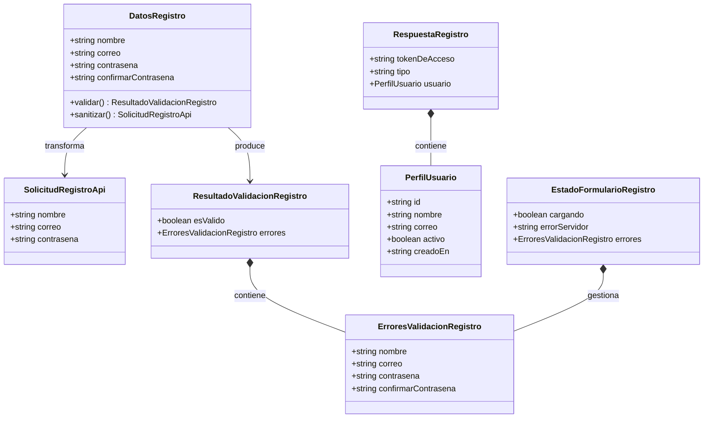
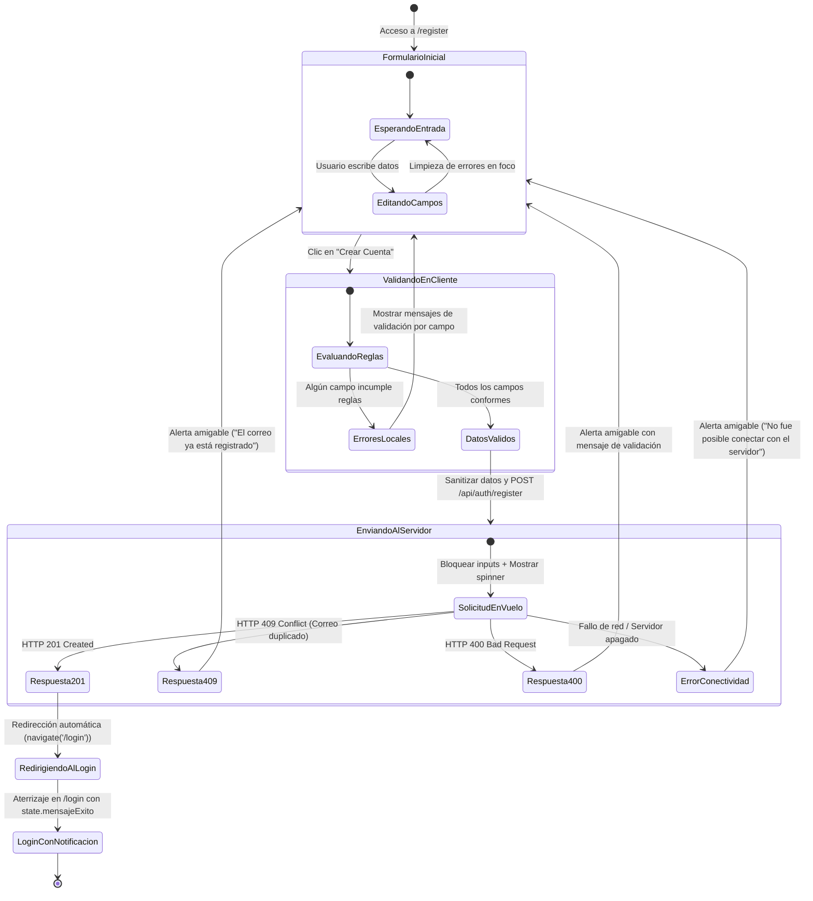

# Modelo de Datos y Estados: Registro de Usuario en Frontend (004-frontend-signup)

## 1. Entidades y Modelos del Cliente (TypeScript)

El frontend modela los datos de registro, validación local y comunicación con la API del backend, manteniendo estricta adherencia a la Constitución del proyecto (Principio V: identificadores de dominio en español sin acentos ni ñ; términos arquitectónicos en inglés).



---

### 1.1 `DatosRegistro` (Estado Local del Formulario)

Representa los valores capturados por los campos del formulario en la vista `RegisterView`.

| Campo | Tipo | Requerido | Regla / Restricción de Validación en Cliente | Mensaje de Error en Español |
| :--- | :--- | :---: | :--- | :--- |
| `nombre` | `string` | Sí | No vacío tras `trim()`. Longitud entre 2 y 100 caracteres. | `"El nombre es obligatorio y debe tener entre 2 y 100 caracteres."` |
| `correo` | `string` | Sí | No vacío tras `trim()`. Sintaxis válida de email (regex: `^[^\s@]+@[^\s@]+\.[^\s@]+$`). | Vacío: `"El correo electrónico es obligatorio."`<br>Inválido: `"El formato del correo electrónico es inválido."` |
| `contrasena` | `string` | Sí | No vacía. Mínimo 8 caracteres. Al menos 1 mayúscula, 1 minúscula y 1 número. | Vacía: `"La contraseña es obligatoria."`<br>Débil: `"La contraseña debe tener al menos 8 caracteres, incluyendo una mayúscula, una minúscula y un número."` |
| `confirmarContrasena` | `string` | Sí | No vacía. Debe coincidir exactamente con el valor del campo `contrasena`. | Vacía: `"La confirmación de la contraseña es obligatoria."`<br>No coincide: `"Las contraseñas no coinciden."` |

---

### 1.2 `SolicitudRegistroApi` (DTO de Envío al Backend)

Payload JSON transmitido en la petición HTTP `POST /api/auth/register`. Corresponde directamente con el `RegistroUsuarioDto` del backend.

```typescript
export interface SolicitudRegistroApi {
  nombre: string;
  correo: string;
  contrasena: string;
}
```

- **Normalización**: Antes del envío, `nombre` se envía con `trim()`, `correo` se normaliza con `trim().toLowerCase()`, y `contrasena` se transmite sin alteración para preservar la entropía definida por el usuario.

---

### 1.3 `RespuestaRegistro` (DTO de Respuesta Exitosa HTTP 201)

Estructura devuelta por el backend (`RespuestaAutenticacionDto`) ante la creación satisfactoria del usuario.

```typescript
export interface RespuestaRegistro {
  tokenDeAcceso: string;
  tipo: string; // 'Bearer'
  usuario: {
    id: string; // UUID v4
    nombre: string;
    correo: string;
    activo: boolean;
    creadoEn: string; // ISO 8601
  };
}
```

---

### 1.4 `EstadoFormularioRegistro` (Estado Local de la Vista)

Estado reactivo gestionado internamente por el componente `RegisterView`.

| Atributo | Tipo | Valor Inicial | Descripción |
| :--- | :--- | :---: | :--- |
| `cargando` | `boolean` | `false` | Indica si una petición de registro se encuentra en curso (deshabilita inputs y botón). |
| `errorServidor` | `string \| null` | `null` | Mensaje de error amigable recibido del backend (ej. correo duplicado o servidor inalcanzable). |
| `erroresValidacion` | `ErroresValidacionRegistro` | `{}` | Mapeo de errores locales campo por campo para feedback inmediato. |

---

### 1.5 Notificación de Éxito en `LoginView` (`EstadoNavegacionLogin`)

Información transmitida a través del historial de React Router al redirigir al login tras un registro exitoso.

```typescript
export interface EstadoNavegacionLogin {
  mensajeExito?: string;
}
```

---

## 2. Máquina de Estados del Flujo de Registro


