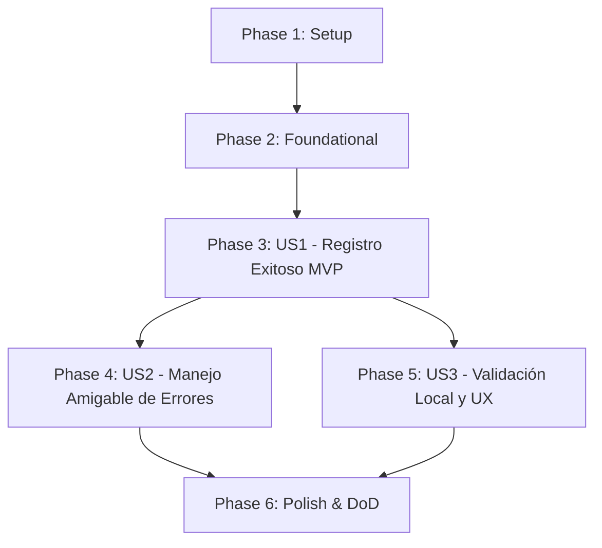

# Tasks: Registro de Usuario en Frontend (004-frontend-signup)

**Input**: Feature specification from `specs/004-frontend-signup/spec.md` and implementation plan from `specs/004-frontend-signup/plan.md`.

## Format: `[TaskID] [P?] [Story?] Description with file path`

- **[P]**: Parallelizable task (independent file / module without pending dependencies)
- **[Story]**: User story identifier (`[US1]`, `[US2]`, `[US3]`) for user-story specific phases

---

## Phase 1: Setup (Shared Infrastructure)

**Purpose**: Preparación de tipos e interfaces de dominio para el flujo de registro de usuario.

- [x] T001 [P] Definir tipos e interfaces TypeScript para registro (`SolicitudRegistroApi`, `RespuestaRegistro`, `ErroresValidacionRegistro`, `EstadoFormularioRegistro`, `EstadoNavegacionLogin`) en frontend/src/types/auth.types.ts
- [x] T002 [P] Declarar estilos CSS adicionales para el formulario de registro (badges de fortaleza, mensajes de ayuda y alertas de éxito/error) en frontend/src/styles/login.css

---

## Phase 2: Foundational (Blocking Prerequisites)

**Purpose**: Infraestructura compartida de validación y cliente HTTP que bloquea la implementación de las historias de usuario.

**⚠️ CRITICAL**: Ninguna historia de usuario puede completarse sin estas funciones base.

- [x] T003 Implementar funciones de validación y sanitización en cliente (`validarNombre`, `validarFormatoContrasena`, `validarConfirmacionContrasena`, `validarFormularioRegistro`, `sanitizarDatosRegistro`) con restricciones exactas en frontend/src/utils/validaciones.ts
- [x] T004 [P] Implementar tests unitarios exhaustivos para las validaciones y sanitizaciones de registro en frontend/tests/unit/validaciones-registro.test.ts
- [x] T005 Implementar función cliente `registrarUsuario(datos: SolicitudRegistroApi)` con consumo de `POST /api/auth/register` y normalización de errores en frontend/src/api/auth-api.client.ts

**Checkpoint**: Base de datos de tipos, validación y cliente API lista. Las historias de usuario pueden implementarse.

---

## Phase 3: User Story 1 - Registro Exitoso de Nuevo Usuario y Redirección al Login (Priority: P1) 🎯 MVP

**Goal**: Permitir al visitante completar el formulario de registro con datos válidos, procesar el alta contra el endpoint `POST /api/auth/register`, deshabilitar inputs con indicador de carga para evitar envíos dobles, y tras la respuesta HTTP 201 redirigir automáticamente a `/login` pasando el mensaje de éxito de bienvenida.

**Independent Test**: Completar el formulario con datos válidos en `/register`, verificar que se consuma `POST /api/auth/register`, y comprobar que se redirige automáticamente a `/login` desplegando la notificación verde de bienvenida.

### Tests for User Story 1 ⚠️

- [x] T006 [P] [US1] Crear test de integración para el flujo exitoso de registro y redirección con mensaje en frontend/tests/integration/RegisterView.test.tsx

### Implementation for User Story 1

- [x] T007 [US1] Implementar vista de registro base `RegisterView` con formulario de campos (`nombre`, `correo`, `contrasena`, `confirmarContrasena`), indicador de carga y llamada a `registrarUsuario` con redirección a `/login` con `state.mensajeExito` en frontend/src/views/RegisterView.tsx
- [x] T008 [US1] Actualizar `LoginView` para leer `location.state?.mensajeExito` y presentar la alerta amigable de confirmación de cuenta creada en frontend/src/views/LoginView.tsx
- [x] T009 [US1] Configurar la ruta `/register` envuelta en `PublicRoute` dentro del enrutador de la aplicación en frontend/src/routes/AppRoutes.tsx

**Checkpoint**: User Story 1 (MVP) completamente funcional e independientemente testable.

---

## Phase 4: User Story 2 - Presentación Clara y Amigable de Errores del Servicio (Priority: P2)

**Goal**: Capturar e interpretar de forma comprensible los errores emitidos por la API (HTTP 409 conflicto por correo duplicado, HTTP 400 validaciones de servidor o fallas de red), mostrándolos en una alerta en español dentro de la tarjeta de registro sin perder los campos ingresados ni congelar la pantalla.

**Independent Test**: Intentar registrar un usuario con un correo existente (HTTP 409) o simular desconexión del backend; verificar que la interfaz presente el mensaje en español ("El correo electrónico ya se encuentra registrado. Intenta iniciar sesión o utiliza otra dirección.") manteniendo los datos intactos en el formulario.

### Tests for User Story 2 ⚠️

- [x] T010 [P] [US2] Agregar casos de prueba de integración en `RegisterView.test.tsx` para manejo de error 409 por correo duplicado, error 400 y errores de red en frontend/tests/integration/RegisterView.test.tsx

### Implementation for User Story 2

- [x] T011 [US2] Incorporar manejo de errores HTTP y renderizado del banner amigable de error (`errorServidor`) con atributos de accesibilidad `role="alert"` en frontend/src/views/RegisterView.tsx
- [x] T012 [US2] Manejar y transformar códigos de error de respuesta de registro (409 Conflict y errores de red) en mensajes amigables y descriptivos en frontend/src/api/auth-api.client.ts

**Checkpoint**: User Story 1 y 2 operan de forma robusta frente a éxitos y fallas del servidor.

---

## Phase 5: User Story 3 - Validación Local y Experiencia Visual Coherente (Priority: P3)

**Goal**: Garantizar consistencia visual del 100% con la estética de `LoginView` (glassmorphism, tema oscuro deportivo/financiero, botones, accesibilidad WCAG), validación en tiempo real y previo al envío con mensajes de error contextuales debajo de cada campo, y navegación bidireccional mediante enlaces entre `/login` y `/register`.

**Independent Test**: Navegar entre `/login` y `/register` mediante los enlaces; verificar la coherencia visual; enviar campos incompletos o contraseñas débiles comprobando que el cliente bloquea la llamada HTTP y resalta los errores locales.

### Tests for User Story 3 ⚠️

- [x] T013 [P] [US3] Agregar casos de prueba de integración para validación local en tiempo real, bloqueo de envío si hay errores sintácticos y navegación bidireccional en frontend/tests/integration/RegisterView.test.tsx
- [x] T014 [P] [US3] Agregar test en `LoginView.test.tsx` verificando la presencia y funcionamiento del enlace hacia la pantalla de registro en frontend/tests/integration/LoginView.test.tsx

### Implementation for User Story 3

- [x] T015 [US3] Integrar validaciones en tiempo real (`onBlur`/`onChange`) y bloqueo de submit con mensajes debajo de cada input (`aria-invalid`, `aria-describedby`) en frontend/src/views/RegisterView.tsx
- [x] T016 [US3] Agregar enlace de navegación hacia `/login` ("¿Ya tienes cuenta? Inicia sesión aquí") en el pie de la tarjeta en frontend/src/views/RegisterView.tsx
- [x] T017 [US3] Agregar enlace de navegación hacia `/register` ("¿No tienes cuenta? Regístrate aquí") en la tarjeta de login en frontend/src/views/LoginView.tsx
- [x] T018 [US3] Verificar y ajustar responsividad en móviles y accesibilidad WCAG (contrastes, roles, foco, etiquetas semánticas) en frontend/src/styles/login.css

**Checkpoint**: Todas las historias de usuario (US1, US2, US3) implementadas, testeadas e integradas armónicamente.

---

## Phase 6: Polish & Cross-Cutting Concerns

**Purpose**: Verificación global de calidad, ejecución de suites de pruebas y cumplimiento de la Constitución.

- [x] T019 [P] Ejecutar la suite completa de pruebas unitarias y de integración del frontend (`npm test` en `frontend/`) verificando que todos los tests pasen sin regresiones
- [x] T020 Validar los 5 escenarios de prueba manual descritos en specs/004-frontend-signup/quickstart.md
- [x] T021 Verificar que no se hayan modificado ni roto tests preexistentes en cumplimiento del Principio IV de la Constitución

---

## Dependencies & Execution Order

### Phase Dependencies

- **Setup (Phase 1)**: Sin dependencias — inicio inmediato.
- **Foundational (Phase 2)**: Depende de Setup — **BLOQUEA** la implementación de las historias de usuario.
- **User Story 1 (Phase 3)**: Depende de Foundational (Phase 2) — Núcleo del MVP.
- **User Story 2 (Phase 4)**: Depende de User Story 1 — Mejora el manejo de respuestas del servidor.
- **User Story 3 (Phase 5)**: Depende de User Story 1 y Foundational — Refina validación local, UX y navegación.
- **Polish (Phase 6)**: Depende de la finalización de todas las historias de usuario.

### User Story Dependencies

---

## Parallel Opportunities

- **Fase 1**: `T001` (auth.types.ts) y `T002` (login.css) pueden desarrollarse en paralelo.
- **Fase 2**: `T004` (tests unitarios de validación) puede desarrollarse en paralelo con `T005` (auth-api.client.ts) tras `T003`.
- **Fase 3**: `T006` (tests de integración US1) se escribe antes o en paralelo con el scaffolding de `T007`.
- **Fase 4 & 5**: Una vez implementado US1, los tests y ajustes de US2 (`T010`) y US3 (`T013`, `T014`) pueden ejecutarse en paralelo por diferentes tareas o desarrolladores.

---

## Implementation Strategy

### MVP First (User Story 1 Only)

1. Completar **Fase 1: Setup** (T001 - T002).
2. Completar **Fase 2: Foundational** (T003 - T005).
3. Completar **Fase 3: User Story 1** (T006 - T009).
4. **VALIDAR**: Verificar que un usuario pueda registrarse en `/register` y ser redirigido a `/login` con el mensaje flash.
5. El sistema ya cuenta con el flujo esencial de registro operativo (MVP listo).

### Incremental Delivery

1. Setup + Foundational → Base lista.
2. User Story 1 → Registro funcional con redirección (MVP).
3. User Story 2 → Manejo amigable y detallado de errores HTTP 409/400/red.
4. User Story 3 → Validación en tiempo real, micro-feedback, enlaces bidireccionales y accesibilidad completa.
5. Polish → Verificación DoD, suite completa de tests en verde, inmutabilidad de tests preservada.
