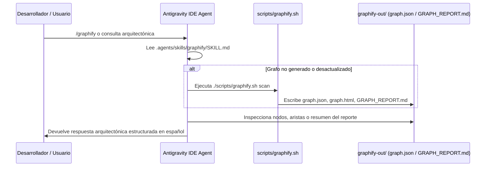

# Interface Contract: Antigravity IDE Skill (`.agents/skills/graphify/SKILL.md`)

**Feature Branch**: `007-integrate-graphify-cli`  
**Contract Version**: `1.0.0`  
**Spec**: [specs/007-integrate-graphify-cli/spec.md](file:///home/ale/Escritorio/Repositorios/dapps2026GrupoQ/specs/007-integrate-graphify-cli/spec.md)

---

## 1. Propósito

Definir la especificación contractual para la Workspace Skill de Antigravity IDE encargada de facilitar la generación, navegación y consulta asistida del grafo de conocimiento del repositorio sin dependencias en la nube ni servidores MCP.

---

## 2. Estructura y Frontmatter del Archivo

- **Ruta en Repositorio**: `.agents/skills/graphify/SKILL.md`
- **Frontmatter YAML Requerido**:
  ```yaml
  ---
  name: "graphify"
  description: "Analizar la arquitectura del repositorio y navegar el grafo de conocimiento local usando Graphify CLI (sin MCP ni nube)."
  compatibility: "Antigravity IDE y agentes basados en agy-customizations"
  metadata:
    author: "Grupo Q"
    scope: "workspace"
  ---
  ```

---

## 3. Disparadores y Modos de Invocación

1. **Invocación Explícita por Slash Command**:
   - Disparador: `/graphify [subcomando / consulta]`
   - Ejemplos:
     - `/graphify`: Ejecuta el escaneo del repositorio o regenera el grafo si está desactualizado.
     - `/graphify report`: Muestra el resumen del reporte de nodos y comunidades.
     - `/graphify query <concepto>`: Rastrea un concepto o entidad (ej. `jugador`) en el grafo generado.
2. **Invocación Contextual por el Agente**:
   - Cuando el usuario formula preguntas arquitectónicas globales (ej. *"¿Cómo interactúan los controladores NestJS con el catálogo de jugadores y la capa de dominio?"* o *"¿Cuáles son las dependencias del módulo de autenticación?"*), el agente consulta `.agents/skills/graphify/SKILL.md` para inspeccionar `graphify-out/graph.json` y `graphify-out/GRAPH_REPORT.md` en vez de realizar lecturas masivas de archivos.

---

## 4. Flujo de Ejecución Interno de la Skill



---

## 5. Reglas de Comportamiento del Agente bajo esta Skill

1. **Modo 100% Offline**: El agente NUNCA configurará servidores MCP ni intentará conectar a `graphify.com` o endpoints SaaS.
2. **Preservación del Context Window**: El agente no debe volcar el contenido bruto de `graph.json` en su respuesta; debe filtrar e interpretar los nodos y aristas relevantes para responder puntualmente a la duda del desarrollador.
3. **Idioma**: Todas las respuestas y explicaciones proporcionadas al usuario deben formularse en español (Principio V de la Constitución).
