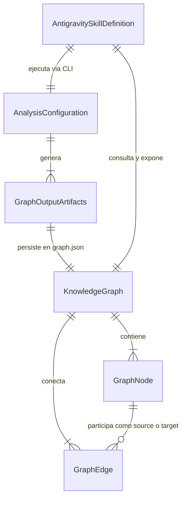

# Data Model: Integración de Graphify CLI para Análisis del Repositorio

**Feature Branch**: `007-integrate-graphify-cli`  
**Date**: 2026-10-05  
**Spec**: [specs/007-integrate-graphify-cli/spec.md](file:///home/ale/Escritorio/Repositorios/dapps2026GrupoQ/specs/007-integrate-graphify-cli/spec.md)

---

## 1. Entidades Principales

### 1.1 `KnowledgeGraph` (Grafo de Conocimiento del Repositorio)

Representa el modelo relacional generado a partir del escaneo estático de código fuente, especificaciones y documentación del proyecto.

| Campo | Tipo | Requerido | Descripción |
| --- | --- | --- | --- |
| `nodes` | `GraphNode[]` | Sí | Colección de nodos identificados en el repositorio (módulos, clases, funciones, componentes, especificaciones). |
| `edges` | `GraphEdge[]` | Sí | Colección de aristas que relacionan los nodos (imports, llamadas, dependencias, referencias). |
| `hyperedges` | `GraphHyperedge[]` | No | Relaciones grupales de 3 o más nodos que participan en un flujo o patrón compartido. |
| `metadata` | `GraphMetadata` | Sí | Metadatos de la corrida (fecha de generación, commit hash de Git analizado, total de archivos analizados). |

#### Sub-entidad `GraphNode`

| Campo | Tipo | Requerido | Descripción |
| --- | --- | --- | --- |
| `id` | `string` | Sí | Identificador canónico único del nodo (ejemplo: `backend_src_domain_jugador_ts_jugador`). |
| `label` | `string` | Sí | Nombre legible para humanos (ejemplo: `Jugador (Domain Entity)`). |
| `file_type` | `enum('code', 'document', 'spec')` | Sí | Categoría de archivo origen. |
| `source_file` | `string` | Sí | Ruta relativa dentro del repositorio (ejemplo: `backend/src/domain/jugador.ts`). |
| `community` | `number \| string` | No | Identificador del clúster arquitectónico asignado por detección de comunidades (Leiden). |
| `source_location` | `object \| null` | No | Rango de líneas (start/end) donde reside el símbolo en el archivo. |

#### Sub-entidad `GraphEdge`

| Campo | Tipo | Requerido | Descripción |
| --- | --- | --- | --- |
| `source` | `string` | Sí | `id` del nodo emisor de la relación. |
| `target` | `string` | Sí | `id` del nodo receptor de la relación. |
| `relation` | `enum('calls', 'imports', 'implements', 'references', 'semantically_similar_to')` | Sí | Tipo de relación semántica o estructural. |
| `confidence` | `enum('EXTRACTED', 'INFERRED', 'AMBIGUOUS')` | Sí | Nivel de certeza de la relación (EXTRACTED para AST determinístico). |
| `confidence_score`| `number` | Sí | Puntuación numérica normalizada entre `0.0` y `1.0`. |
| `weight` | `number` | Sí | Peso de la arista para recorridos y centralidad (por defecto `1.0`). |
| `source_file` | `string` | Sí | Archivo donde se evidencia la conexión. |

---

### 1.2 `AnalysisConfiguration` (Configuración de Análisis Local)

Parámetros que controlan la ejecución del escaneo de Graphify CLI para asegurar determinismo, rendimiento (<2 min) y aislamiento offline.

| Propiedad | Tipo | Valor / Regla | Propósito |
| --- | --- | --- | --- |
| `target_paths` | `string[]` | `['backend/src', 'frontend/src', 'specs', 'docs', 'docker-compose.yml']` | Rutas del repositorio analizadas (FR-005). |
| `ignore_patterns`| `string[]` | `['node_modules/**', 'dist/**', 'build/**', '.git/**', 'coverage/**', 'logs/**', 'postgres_data/**']` | Rutas y patrones estrictamente omitidos (FR-006). |
| `output_dir` | `string` | `graphify-out/` | Directorio local donde se persisten los artefactos generados (FR-007). |
| `allow_mcp` | `boolean` | `false` | Prohibición absoluta de endpoints o servidores MCP (FR-003). |
| `allow_cloud` | `boolean` | `false` | Prohibición absoluta de sincronización con Graphify Hosted (FR-002, FR-004). |
| `deterministic_mode` | `boolean` | `true` | Extracción AST basada en Tree-sitter para reproducibilidad offline. |

---

### 1.3 `GraphOutputArtifacts` (Artefactos del Grafo)

Estructura de archivos y directorios producidos localmente por Graphify CLI dentro de `graphify-out/`.

```text
graphify-out/
├── graph.json        # Grafo completo en formato JSON estándar (máquinas, agentes y scripts)
├── graph.html        # Visualizador gráfico interactivo offline autónomo (desarrolladores)
├── GRAPH_REPORT.md   # Reporte sintético: nodos centrales (god nodes), comunidades y métricas
└── cache/            # Caché SHA256 de archivos para acelerar ejecuciones incrementales
```

---

### 1.4 `AntigravitySkillDefinition` (Definición de Skill para Antigravity IDE)

Descriptor de la extensión local para Antigravity IDE que habilita el soporte contextual en el entorno de desarrollo.

| Propiedad | Tipo | Valor |
| --- | --- | --- |
| `location` | `string` | `.agents/skills/graphify/SKILL.md` |
| `name` | `string` | `graphify` |
| `trigger` | `string` | `/graphify` |
| `scope` | `enum` | `Workspace` (específica del repositorio) |
| `protocol` | `enum` | `CLI / Subprocess / Local Filesystem` (sin MCP) |

---

## 2. Diagrama de Relaciones de Entidades



---

## 3. Reglas de Validación y Estados

1. **Aislamiento de Red (Offline Invariant)**:
   - Todo intento de conexión saliente o solicitud de API Key de nube durante el análisis invalida el estado y produce terminación inmediata con error.
2. **Exclusión de Control de Versiones**:
   - Todo archivo creado en `graphify-out/`, `.graphify_cache/` o `.venv-graphify/` debe coincidir con una regla de `.gitignore`.
3. **Idempotencia y Reejecución Limpia**:
   - Una nueva corrida de análisis sobrescribe determinísticamente `graph.json`, `graph.html` y `GRAPH_REPORT.md` sin dejar artefactos huérfanos.
